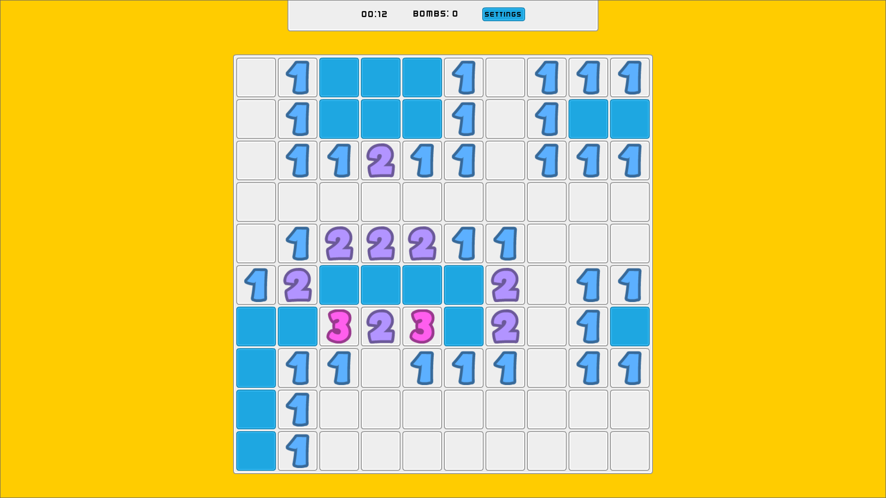

# Minesweeper clone with a twist

## Features

- Displays the game details in your discord's about me page (RichPresence)

## In progress

- LootLocker API for leaderboard control.
- First click guarantee (the first tile you clicked is never a mine)
- No guessing guarantee (eliminate luck based plays, this is a logic/puzzle game after all!)
- Quests
- Helper items (e.g. Radar)

## Godot 4

The game was originally created in Godot 3, but since then was ported to Godot 4 for better dotnet support.

_Currently `main` branch contains 1 to 1 port from Godot 3 to Godot 4. Default branch `csharp_port` is mostly written in C# (~ 80%). Note that this is not a finished project and so it still lacks many functionalities that you might expect (e.g. first click guarantee), but are planned to be implemented._
